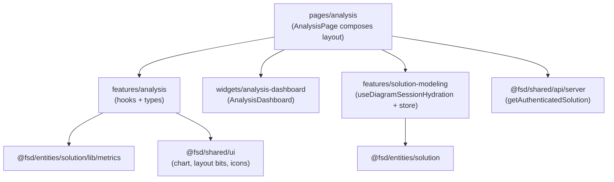
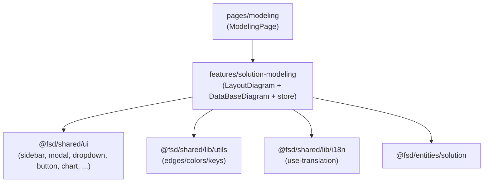
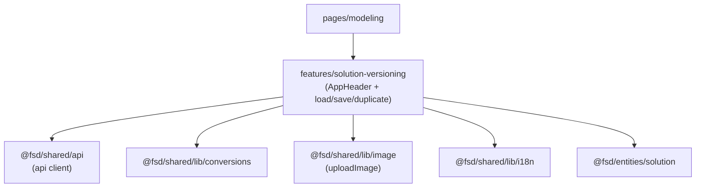
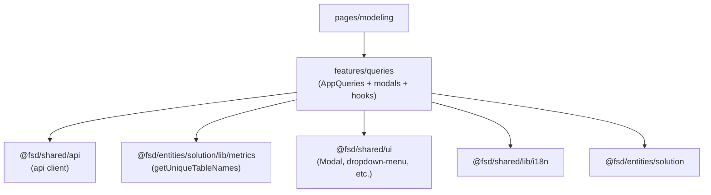
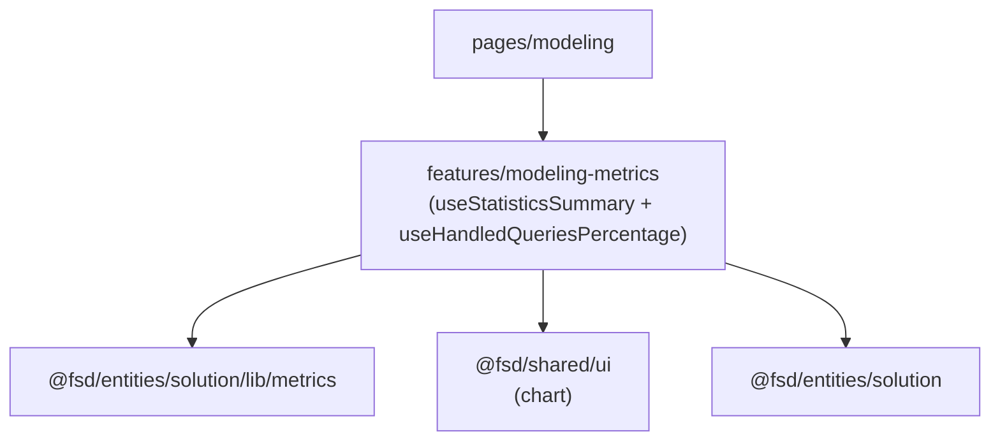
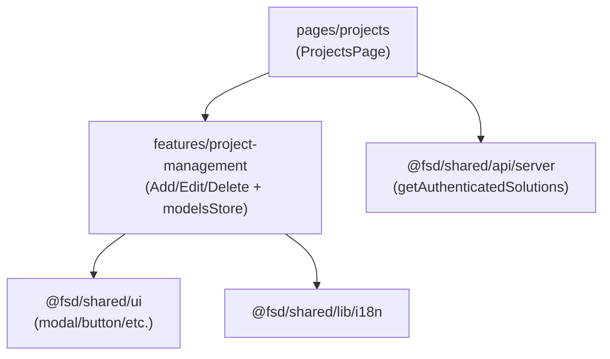
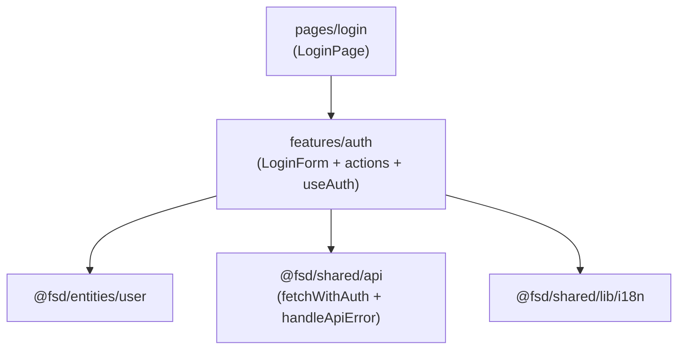

# Frontend Architecture — Feature-Sliced Design (FSD) in `DBCapibara-next`

Este documento contiene:

- Un **diagrama general** (superficial) de la arquitectura FSD.
- Un **diagrama detallado** (granular) por capas/slices y sus relaciones.
- **Diagramas por feature** (enfoque slice-by-slice).

> Convenciones usadas:
>
> - Las capas siguen: `shared → entities → features → pages → app`.
> - Los imports “permitidos” fluyen de capas superiores hacia inferiores (p. ej. `pages` usa `features/entities/shared`).
> - Los nombres reflejan las Public APIs (`index.ts`) donde aplica.

---

## 1) Diagrama general (superficial)

```mermaid
flowchart TB
  appLayer[app (Next.js routes + global providers)] --> pagesLayer[pages (route screens)]
  pagesLayer --> featuresLayer[features (user actions)]
  featuresLayer --> entitiesLayer[entities (domain types)]
  featuresLayer --> sharedLayer[shared (tech base)]
  pagesLayer --> entitiesLayer
  pagesLayer --> sharedLayer
  entitiesLayer --> sharedLayer
```

---

## 2) Diagrama detallado (muy específico) — Capas + Slices actuales

```mermaid
flowchart TB
  %% ======================
  %% App layer (Next routes)
  %% ======================
  subgraph appLayer [app]
    appLayout["app/layout.tsx\nRootLayout + Providers"]
    routeLogin["app/login/page.tsx"]
    routeModels["app/models/page.tsx"]
    routeCanva["app/models/[diagramId]/modeling/page.tsx"]
    routeAnalysis["app/models/[diagramId]/analysis/page.tsx"]
    routeError["app/error.tsx"]
  end

  %% ======================
  %% Pages layer
  %% ======================
  subgraph pagesLayer [pages]
    pageLogin["pages/login\n(LoginPage)"]
    pageProjects["pages/projects\n(ProjectsPage + getSolutions.server)"]
    pageCanva["pages/modeling\n(ModelingPage + getDiagramData.server)"]
    pageAnalysis["pages/analysis\n(AnalysisPage + getAnalysisData.server)"]
  end

  %% ======================
  %% Features layer
  %% ======================
  subgraph featuresLayer [features]
    featAuth["auth\n(useAuth + login UI/actions)"]
    featProjectMgmt["project-management\n(Add/Edit/Delete + modelsStore)"]
    featSolutionModeling["solution-modeling\n(canvas store + LayoutDiagram + DiagramHydration)"]
    featSolutionVersioning["solution-versioning\n(AppHeader + load/save/duplicate versions)"]
    featQueries["queries\n(AppQueries + query ops + selection)"]
    featModelingMetrics["modeling-metrics\n(hooks: summary + queries %)"]
    featAnalysis["analysis\n(model: hooks + chart types)"]
  end

  %% ======================
  %% Entities layer
  %% ======================
  subgraph entitiesLayer [entities]
    entSolution["solution\n(types: SolutionModel, VersionFrontend, Query, TableData, ...)"]
    entSolutionLibMetrics["solution/lib/metrics\n(redundancy, recoveryCost, accessPattern, queries)"]
    entUser["user\n(types: User, LoginCredentials, RegisterData)"]
  end

  %% ======================
  %% Shared layer
  %% ======================
  subgraph sharedLayer [shared]
    sharedApi["shared/api\n(client + validators + handleApiError)"]
    sharedApiServer["shared/api/server\n(getAuthenticatedSolution(s), serverFetchWithAuth, ...)"]
    sharedLibConversions["shared/lib/conversions\n(transformSolutionModel, transformVersionToBackend)"]
    sharedLibUtils["shared/lib/utils\n(edges/colors/keys helpers)"]
    sharedLibI18n["shared/lib/i18n\n(translations + use-translation hook)"]
    sharedLibImage["shared/lib/image\n(uploadImage)"]
    sharedUi["shared/ui\n(shadcn kit + icons + sidebar + charts + modal + ...)"]
  end

  %% ======================
  %% App -> Pages (routing)
  %% ======================
  appLayout --> sharedUi
  appLayout --> sharedLibI18n
  appLayout --> sharedApi
  appLayout --> featAuth

  routeLogin --> pageLogin
  routeModels --> pageProjects
  routeCanva --> pageCanva
  routeAnalysis --> pageAnalysis
  routeError --> sharedLibI18n

  %% ======================
  %% Pages -> Features
  %% ======================
  pageLogin --> featAuth
  pageProjects --> featAuth
  pageProjects --> featProjectMgmt
  pageProjects --> sharedApiServer
  pageCanva --> featSolutionModeling
  pageCanva --> featSolutionVersioning
  pageCanva --> featQueries
  pageCanva --> featModelingMetrics
  pageCanva --> sharedApiServer
  pageAnalysis --> featAnalysis
  pageAnalysis --> featSolutionModeling
  pageAnalysis --> sharedApiServer

  %% ======================
  %% Features -> Entities/Shared
  %% ======================
  featAuth --> entUser
  featAuth --> sharedApi
  featAuth --> sharedLibI18n

  featProjectMgmt --> sharedUi
  featProjectMgmt --> sharedLibI18n

  featSolutionModeling --> entSolution
  featSolutionModeling --> sharedUi
  featSolutionModeling --> sharedLibUtils
  featSolutionModeling --> sharedLibI18n

  featSolutionVersioning --> entSolution
  featSolutionVersioning --> sharedApi
  featSolutionVersioning --> sharedLibConversions
  featSolutionVersioning --> sharedLibImage
  featSolutionVersioning --> sharedLibI18n
  featSolutionVersioning --> sharedUi

  featQueries --> entSolution
  featQueries --> sharedApi
  featQueries --> entSolutionLibMetrics
  featQueries --> sharedUi
  featQueries --> sharedLibI18n

  featModelingMetrics --> entSolution
  featModelingMetrics --> entSolutionLibMetrics
  featModelingMetrics --> sharedUi

  featAnalysis --> featSolutionModeling
  featAnalysis --> entSolutionLibMetrics
  featAnalysis --> sharedUi

  %% ======================
  %% Entities -> Shared
  %% ======================
  entSolution --> sharedLibUtils
  entSolution --> sharedLibConversions
  entSolution --> entSolutionLibMetrics
  entUser --> sharedApi
```



> Nota: `analysis` consume `solution-modeling` para hidratar/leer el estado del diagrama (store + types).

---

## 3) Diagramas por feature (slice-by-slice)

### 3.1 Feature `analysis`



### 3.2 Feature `solution-modeling`



### 3.3 Feature `solution-versioning`



### 3.4 Feature `queries`



### 3.5 Feature `modeling-metrics`



### 3.6 Feature `project-management`



### 3.7 Feature `auth`



---

## Apéndice — Public APIs (puntos de entrada)

- `shared`\n - `src/shared/api/index.ts`\n - `src/shared/api/server/index.ts`\n - `src/shared/ui/*`\n - `src/shared/lib/*`\n- `entities`\n - `src/entities/solution/index.ts`\n - `src/entities/user/index.ts`\n- `features`\n - `src/features/*/index.ts`\n- `pages`\n - `src/pages/*/index.ts`\n- `app`\n - `app/**/*.tsx`\n+
