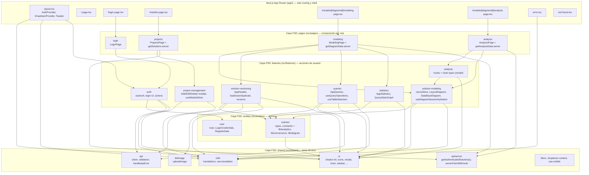

# Diagrama FSD adaptado a Next.js — Código Mermaid

Copia el bloque siguiente en cualquier visor Mermaid (GitHub, GitLab, Mermaid Live Editor, o un `.md` con soporte Mermaid).

```mermaid
flowchart TB
  subgraph NextApp ["Next.js App Router (app/) — solo routing y shell"]
    layout["layout.tsx\nAuthProvider, DropdownProvider, Toaster"]
    routeRoot["/ page.tsx"]
    routeLogin["/login page.tsx"]
    routeModels["/models page.tsx"]
    routeCanva["/models/[diagramId]/modeling page.tsx"]
    routeAnalysis["/models/[diagramId]/analysis page.tsx"]
    routeError["error.tsx"]
    routeNotFound["not-found.tsx"]
  end

  subgraph FSDPages ["Capa FSD: pages (src/pages) — composición por ruta"]
    pageLogin["login\nLoginPage"]
    pageProjects["projects\nProjectsPage + getSolutions.server"]
    pageCanva["modeling\nModelingPage + getDiagramData.server"]
    pageAnalysis["analysis\nAnalysisPage + getAnalysisData.server"]
  end

  subgraph FSDFeatures ["Capa FSD: features (src/features) — acciones de usuario"]
    featAuth["auth\nuseAuth, login UI, actions"]
    featProjectMgmt["project-management\nAdd/Edit/Delete modals, useModelsStore"]
    featSolutionModeling["solution-modeling\ncanvaStore, LayoutDiagram, DataBaseDiagram, useDiagramSessionHydration"]
    featSolutionVersioning["solution-versioning\nAppHeader, load/save/duplicate, versions"]
    featQueries["queries\nAppQueries, useQueryOperations, useTableSelection"]
    featStatistics["statistics\nAppStatistics, QueryStatsGraph"]
    featAnalysis["analysis\nhooks + chart types (model)"]
  end

  subgraph FSDEntities ["Capa FSD: entities (src/entities) — dominio"]
    entSolution["solution\ntypes, constants + lib/analytics, lib/conversions, lib/diagram"]
    entUser["user\nUser, LoginCredentials, RegisterData"]
  end

  subgraph FSDShared ["Capa FSD: shared (src/shared) — base técnica"]
    sharedApi["api\nclient, validators, handleApiError"]
    sharedApiServer["api/server\ngetAuthenticatedSolution(s), serverFetchWithAuth"]
    sharedI18n["i18n\ntranslations, use-translation"]
    sharedUi["ui\nshadcn kit, icons, modal, chart, sidebar, ..."]
    sharedLibImage["lib/image\nuploadImage"]
    sharedLibCn["lib/cn, dropdown-context, use-mobile"]
  end

  layout --> sharedUi
  layout --> sharedI18n
  layout --> featAuth
  routeLogin --> pageLogin
  routeModels --> pageProjects
  routeCanva --> pageCanva
  routeAnalysis --> pageAnalysis
  routeError --> sharedI18n

  pageLogin --> featAuth
  pageProjects --> featProjectMgmt
  pageProjects --> sharedApiServer
  pageCanva --> featSolutionModeling
  pageCanva --> featSolutionVersioning
  pageCanva --> featQueries
  pageCanva --> featStatistics
  pageCanva --> sharedApiServer
  pageAnalysis --> featAnalysis
  pageAnalysis --> featSolutionModeling
  pageAnalysis --> sharedApiServer

  featAuth --> entUser
  featAuth --> sharedApi
  featAuth --> sharedI18n
  featProjectMgmt --> sharedUi
  featProjectMgmt --> sharedI18n
  featSolutionModeling --> entSolution
  featSolutionModeling --> sharedUi
  featSolutionModeling --> sharedI18n
  featSolutionVersioning --> entSolution
  featSolutionVersioning --> sharedApi
  featSolutionVersioning --> sharedLibImage
  featSolutionVersioning --> sharedI18n
  featSolutionVersioning --> sharedUi
  featQueries --> entSolution
  featQueries --> sharedApi
  featQueries --> sharedUi
  featQueries --> sharedI18n
  featStatistics --> entSolution
  featStatistics --> sharedUi
  featAnalysis --> featSolutionModeling
  featAnalysis --> sharedUi

  entSolution --> sharedUi
```
